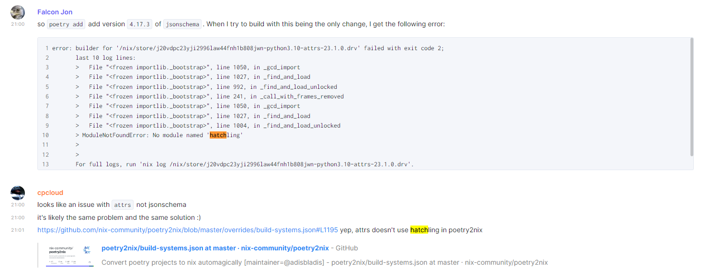

1. I make the shell.nix and load with direnv - :white_check_mark: 

2. Up to the 4 minute mark - :white_check_mark:
   1. I can run the `poetry run imgapp` command and both the hello world url and the image url work well. :white_check_mark:

3. What fails is the nix-build command at 5:15 in the video :spider:
    * It fails with:
        ```bash
        Processing /build/urllib3-2.0.2
        Running command Preparing metadata (pyproject.toml)
        Preparing metadata (pyproject.toml) ... done
        ERROR: Exception:
        Traceback (most recent call last): 
        ... 
        ModuleNotFoundError: No module named 'hatchling'
        ```

        more fail details in the [error_traceback.md](error_traceback.md) file.

4. I have seen in the backchat on poetry2nix Matrix channel that this module was discussed on April 19th 2023 - but I am not sure what was the outcome and action - and how to implement it on my example.


5. For debug purposes:
    ```bash
    $ poetry --version
    Poetry (version 1.4.2)
    $ which poetry
    /nix/store/kn15n62v6g10yk2ka3q5qbq8dp0syq77-python3.10-poetry-1.4.2/bin/poetry
    ```

6. See the branches for what I have tried so far.
   * [Pinned nixpkgs](https://github.com/henrik-ch/tweag-p2nix-video/tree/pin-nixpkgs) to nixpkgs 22.11 - exact same result - no module named hatchling.
   * [Test flake](https://github.com/henrik-ch/tweag-p2nix-video/tree/test-flake) used the flake init as described in the README.md - this nix build command fails with a pillow problem - see the error traceback on this branch.